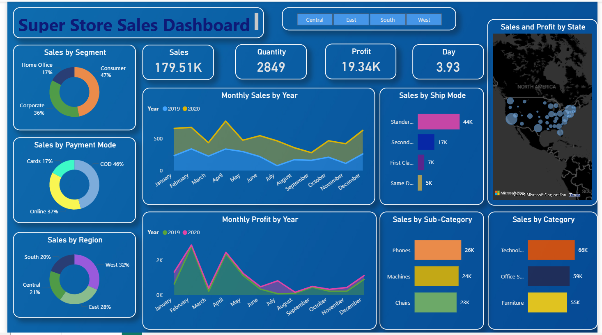
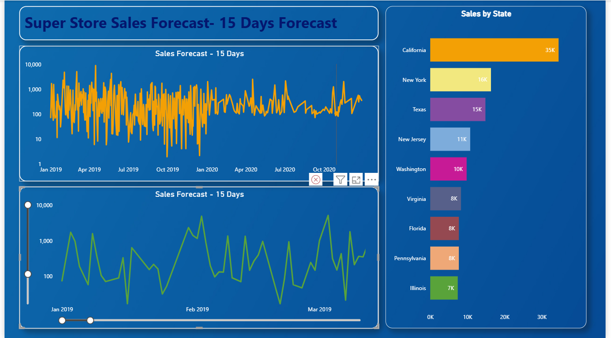

# 🛒 Super-Store-Sales-Dashboard with 15 Days Forecast

An interactive Power BI Sales Analytics Dashboard built to analyze retail sales performance, monitor profit trends, understand customer behavior, and forecast future sales for the next 15 days. This project demonstrates how raw retail business data can be transformed into meaningful visual insights for smarter and faster business decisions.

# 📌 Project Overview

The Super Store Sales Dashboard helps understand:

✔ Overall sales, profit, quantity, and average delivery performance

✔ Monthly sales and profit comparison by year

✔ Customer segment contribution to revenue

✔ Regional sales distribution across different zones

✔ Payment mode preferences of customers

✔ Product category and sub-category performance

✔ Shipping mode efficiency and order volume

✔ State-wise sales analysis

✔ Future sales forecasting for the next 15 days

Instead of manually analyzing spreadsheets, this dashboard provides a complete business intelligence solution using interactive visuals.

# 🎯 Objective

The goal of this project is to:

1.Convert raw retail sales data into valuable insights

2.Track business growth using monthly sales & profit trends

3.Identify top-performing states, regions, and product categories

4.Understand customer purchase behavior

5.Optimize logistics and shipping strategies

6.Predict future sales using forecasting techniques

7.Practice real-world Data Analyst workflow using Power BI

# 🛠️ Tech Stack Used

📊 Power BI Desktop – Dashboard development and data visualization

📂 Power Query – Data cleaning and transformation

🧠 DAX (Data Analysis Expressions) – KPIs, calculated columns & measures

📈 Forecasting Tools – Future sales prediction

📁 Microsoft Excel / CSV – Source dataset

📝 Data Modeling – Relationships and filters

# 📂 Data Source

The dataset is a Super Store retail sales dataset containing:

✔ Order-level transactional records

✔ Sales, profit, quantity, and shipping data

✔ Customer segments (Consumer, Corporate, Home Office)

✔ Product categories & sub-categories

✔ Regional and state-wise sales data

✔ Payment mode details

✔ Monthly historical sales records

This dataset simulates a real-world retail business environment.

# 📊 Dashboard Features & Insights

***Key Performance Indicators (KPIs)***

1.Total Sales: 179.51K

2.Total Quantity Sold: 2849

3.Total Profit: 19.34K

4.Average Delivery Time: 3.93 Days

These KPIs provide a quick summary of business performance.

# 👥 Sales by Segment

1.Consumer – Highest contribution

2.Corporate

3.Home Office

➡ Helps identify major customer groups.

# 💳 Sales by Payment Mode

1.COD

2.Online

3.Cards

➡ Useful for understanding customer payment preferences.

# 🌍 Sales by Region

1.West

2.East

3.Central

4.South

➡ Helps identify strongest performing markets.

# 📅 Monthly Sales by Year

Year-over-year monthly sales comparison for 2019 and 2020.

➡ Useful for seasonal trend analysis.

# 📈 Monthly Profit by Year

Tracks profitability growth and fluctuations month-wise.

➡ Helps improve financial planning.

# 🚚 Sales by Ship Mode

1.Standard Class

2.Second Class

3.First Class

4.Same Day

➡ Supports logistics optimization.

# 📦 Sales by Sub-Category

Top products include:

1.Phones

2.Machines

3.Chairs

➡ Useful for inventory and demand planning.

# 🛍️ Sales by Category

1.Technology

2.Office Supplies

3.Furniture

➡ Shows highest revenue-generating product groups.

# 🗺️ Sales by State

Top performing states include:

1.California

2.New York

3.Texas

4.New Jersey

➡ Helps understand geographical demand.

# 🔮 15 Days Sales Forecast

Forecasting model predicts future sales trends for upcoming 15 days using historical sales data.

➡ Helps businesses prepare stock, operations, and targets in advance.

💡 Business Insights Derived

✔ Consumer segment contributes maximum revenue

✔ West region performs best in overall sales

✔ Technology category generates highest sales

✔ COD is the most used payment method

✔ Standard Class shipping handles most orders

✔ California leads state-wise sales performance

✔ Forecasting helps predict short-term future demand

# 📷 Dashboard Preview

***Dashboard 1***

***Dashboard 2***

# 🚀 Conclusion

This project demonstrates end-to-end Business Intelligence workflow using Power BI — from raw data cleaning to interactive dashboards and future forecasting. It reflects practical skills required for Data Analyst roles.
